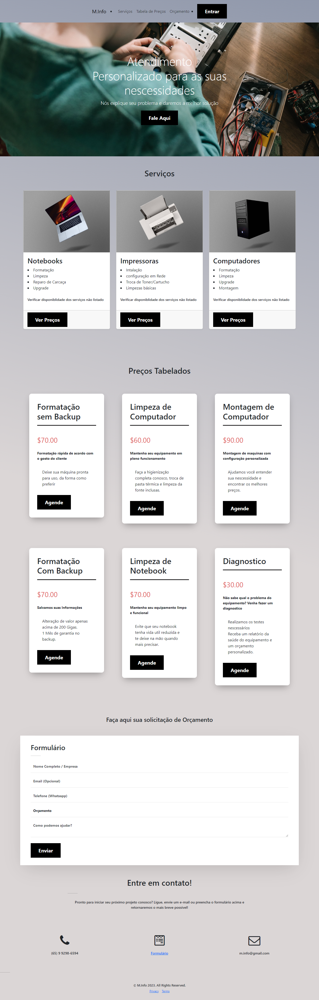

Site exemplo para assistencia tecnica.

1° - Instale as dependencias: **composer install**

2° - Configure o banco de dados MySql no arquivo .ENV 

3° - Migre o banco de dados: **php artisan migrate**

4° - Gere a chave api do laravel: **php artisan key:generate**

5° - Inicie com: **php artisan serve**

